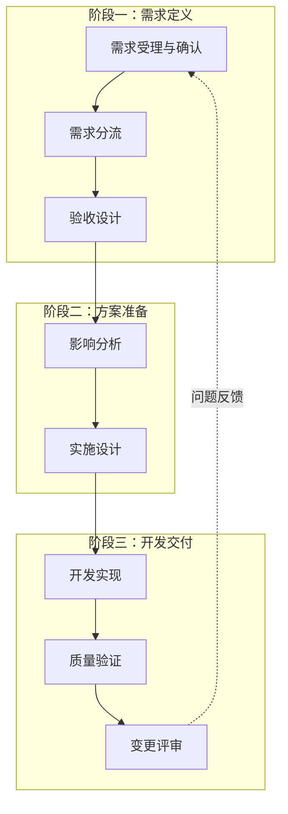

# AI 自动化研发工作流框架

## 文档定位

本文是团队的工作流总览，用于快速理解一项需求从进入研发到完成提交的完整路径。

- 本文只定义阶段、节点、分流规则、任务目录契约和交接关系。
- `skills/` 是唯一执行规范源；每个节点的具体操作、输入输出和质量门槛以对应 `SKILL.md` 为准。
- `workflow-orchestrator` 是唯一流程推进入口，负责读取任务状态、选择下一节点和处理人工关口，不承接节点业务职责。
- AI 负责资料整理、代码扫描、实施、验证和记录；业务决策和风险判断仍由对应 Owner 负责。

## 使用方式

1. 调用 `$workflow-orchestrator` 启动新任务或继续现有任务。
2. 编排器从需求受理开始，并在需求分流节点选择本次执行路径。
3. 编排器逐个读取对应 `skills/<node-id>/SKILL.md` 执行，并将交接物写入任务产物目录。
4. 节点启动前按当前路径校验其“路径级准入产物”；缺失时不得继续执行。

## 适用范围

- 产品需求、缺陷修复、接口调整、设计还原和模块重构。
- 需求与设计截图、缺陷描述、接口契约、Git 仓库、CI 和线上监控数据。
- Web、桌面壳、公共包等项目；不同项目可按风险等级裁剪流程。

## 任务产物规范

每个需求或缺陷都必须有独立任务目录，节点之间只通过文件交接，不依赖聊天记录或个人记忆。

- 默认运行目录：`<tasks-root>/<task-id>/`
- `<tasks-root>` 优先读取 `AI_WORKFLOW_TASKS_DIR`；未设置时根据已安装 skill 的真实路径定位 ai-workflow 仓库根目录，并使用 `./runtime/tasks`
- 如需覆盖默认值，使用环境变量 `AI_WORKFLOW_TASKS_DIR`

`task-id` 默认使用 `<YYYYMMDD-HHMMSS>-<模块名>`。目录根部必须有 `task.yaml`，记录目标模块、当前节点、任务状态、产物清单、下一节点、人工关口和阻塞项。机器字段以 [任务状态 Schema](./skills/workflow-orchestrator/references/contracts/task-state.schema.json) 为准，转换方式参见 [任务生命周期指南](./skills/workflow-orchestrator/references/guides/task-lifecycle.md)。有下一节点表示待启动，CLI 此时返回 `执行节点：<task-id>/<node-id>@<revision>`；只有用户原样提交该固定指令后，`start-node` 才会消费 `next_node`。`current_node` 存在且下一节点为空表示正在执行。

结构化产物和任务状态中的节点标识统一使用无编号的语义化 canonical id，例如 `requirement-intake`、`requirement-routing`、`implementation-design`。以下字段都使用这套 id：

- `node`
- `current_node`
- `next_node`

人工确认不是 skill，使用独立 `gate` 对象表示。每个节点先生成 AI 结论，`workflow-orchestrator` 验证产物后调用状态 CLI 创建 `gate.status: pending`；CLI 返回绑定任务、节点和 revision 的精确确认指令，只有 `workflow-owner` actor 携带用户原样提交的该指令才能批准。变更评审是终点 gate，批准后任务才进入 `completed`。

每个节点完成后必须原子写入对应产物文件，并声明 `task_id`、`node`、`status` 和 `attempt`。目标模块只在 `task.yaml` 维护，节点依赖与执行顺序只从路径契约推导；节点注册表声明子 Schema 时，产物还必须满足节点业务字段约束。节点只能读取 `task.yaml`，不得直接修改它；节点报告结果后，由 `workflow-orchestrator` actor 调用 `./scripts/task-state.rb` 统一校验并按节点登记 attempt 和 SHA-256，再记录普通任务状态、gate 和交付证据；Gate 决策命令只接受 `workflow-owner` actor。

开发实现、质量验证和变更评审还必须按 [交付证据 Schema](./skills/workflow-orchestrator/references/contracts/delivery-evidence.schema.json) 和 [交付证据指南](./skills/workflow-orchestrator/references/guides/delivery-evidence.md) 记录并核对 `base_commit`、`candidate_tree` 和 `change_fingerprint`，避免验证或 Review 期间代码被替换。开发实现负责建立并冻结代码身份，质量验证只写验证结论，变更评审只写 Review 结论。

| 节点 | 固定产物文件 |
| --- | --- |
| 需求受理与确认 | `requirement-analysis.md` |
| 需求分流 | `requirement-routing.json` |
| 验收设计 | `acceptance-checklist.md` |
| 影响分析 | `impact-analysis.md` |
| 实施设计 | `implementation-plan.md` |
| 开发实现 | `development-record.md` |
| 质量验证 | `quality-verification.md` |
| 变更评审 | `change-review.md` |

节点启动时必须先读取其路径级准入产物文件；文件缺失或状态不是 `completed` 时，任务为 `blocked`。每个节点产物都必须经过对应人工 gate；聊天中只输出摘要、产物路径和 CLI 返回的精确确认指令，不作为正式交接物。“继续”“下一个”“执行下一节点”等近似表达既不能批准 Gate，也不能启动节点。

节点重跑使用受控覆盖：编排器先调用 `task-state.rb invalidate-from`，由 CLI 删除当前节点及全部下游产物，同时清除失效范围内的当前批准、blocker 和交付证据。`task.yaml.attempts` 保留每个节点最后一次 attempt，新产物必须使用下一次 attempt；旧产物不保留历史文件。`blocked` 任务完成处置决策后也先执行该命令，不能直接覆盖文件或调用 `start-node`。

任务进入 `completed` 或 `cancelled` 后即为不可变终态，CLI 拒绝继续修改 gate、交付证据和任务状态。若完成后出现新变化，应创建新任务，而不是重开旧任务。

## 全局流程

## 变更分流

所有变更先在需求受理与确认节点完成事实整理和疑点确认，经需求负责人通过该节点 Gate 后，再由需求分流节点选择执行路径。低风险缺陷与常规单模块改动统一进入轻量需求路径。

需求受理与确认使用三组编号维护同一份需求定义：

- `RF-*` 记录资料和代码能够证明的需求事实，`RQ-*` 记录证据无法直接确认的问题。
- 节点执行期间按编号逐条展示疑点标题、具体问题、产生原因、推荐答案和影响范围；Owner 对当前项确认或修改后才能进入下一项。
- 每个 `RQ-*` 必须映射到状态为“已人工确认”的 `CL-*`。状态 CLI 会拒绝遗漏、未知引用、空答案和未人工确认的完成产物；全部逐条确认后再通过节点一 Gate 确认整份需求定义，未批准前不能进入需求分流。
- 没有 `RQ-*` 时，确认决策写“无”，不生成第二份需求规格。
- 接口参数、存储算法、请求竞态、样式实现和测试步骤仍分别属于影响分析、实施设计和验收设计。

需求分流由工作流执行器自动运行：读取需求解析包和目标模块扫描结果，生成 `requirement-routing.json`，再按结果解锁对应节点。自动分流按以下顺序执行：

1. **资料完整性检查**：缺少目标模块、预期行为或关键接口/设计信息时，写为 `status=blocked`、`path=null`，退回需求受理与确认。
2. **复杂触发器检查**：涉及权限、安全、金额、隐私、不可逆删除、数据迁移、破坏性接口契约、公共能力、全局配置或多业务模块时，判定为复杂需求。
3. **轻量需求兜底**：资料明确、范围局限于一个业务模块且未命中复杂触发器时，判定为轻量需求；局部缺陷修复同样归入此路径。

没有有效分流结果时，不允许进入开发实现。资料不足时，需求分流写为 `status=blocked`、`path=null` 并退回需求受理与确认；人工只能升级到更严格路径，不能绕过复杂触发器降级。具体规则见 [需求分流](./skills/requirement-routing/SKILL.md)。

| 路径 | 适用场景 | 最小执行范围 |
| --- | --- | --- |
| 轻量需求 | 单业务模块内的局部缺陷、常规功能或体验调整。 | 需求受理与确认 -> 需求分流 -> 实施设计 -> 开发实现 -> 质量验证 -> 变更评审 |
| 复杂需求 | 命中复杂触发器，或存在多模块、契约、数据和交付风险。 | 需求受理与确认 -> 需求分流 -> 验收设计 -> 影响分析 -> 实施设计 -> 开发实现 -> 质量验证 -> 变更评审 |

上表用于阅读；执行器通过 [契约清单](./skills/workflow-orchestrator/references/contract-manifest.json) 加载各自独立的机器契约。

所有需求类型在变更评审通过且交付代码指纹一致后先等待人工确认；终点 gate 批准后，由状态 CLI 将任务标记为 `completed`。

不同路径的验收依据固定如下，开发实现和质量验证不得临时生成平行标准：

| 路径 | 验收依据 |
| --- | --- |
| 轻量需求 | `implementation-plan.md` 的“最小验收条件” |
| 复杂需求 | `acceptance-checklist.md` |

代码扫描按深度分工，不能在三个节点重复维护完整影响结论：

| 节点 | 扫描职责 | 明确不做 |
| --- | --- | --- |
| 需求受理 | 定位目标模块、入口和直接依赖线索 | 不展开完整文件清单和调用链 |
| 需求分流 | 验证是否命中路径分流触发器 | 不输出完整状态流和回归范围 |
| 影响分析 | 扫描完整文件、接口、状态、依赖和回归边界 | 不设计具体实现方案 |

## 节点地图

每个节点都要沉淀最小交接物并写入任务目录。节点详情统一定义“适用路径、路径级准入产物、本节点产物和缺失处理”；工作流执行器只在当前路径所需产物文件齐全时解锁节点。低风险改动可以使用简短结构化记录，但仍必须落入对应固定文件。

| 阶段 / 节点 | 关键目标 | 最小交接物 | 执行规范 |
| --- | --- | --- | --- |
| 需求定义 / 需求受理与确认 | 整理需求事实，逐条确认疑点并统一业务口径。 | 包含 `RF-*`、`RQ-*` 和 `CL-*` 的需求定义 | [需求受理与确认](./skills/requirement-intake/SKILL.md) |
| 需求定义 / 需求分流 | 自动判断风险等级和执行路径。 | `requirement-routing.json` | [需求分流](./skills/requirement-routing/SKILL.md) |
| 需求定义 / 验收设计 | 定义可执行的验收标准。 | 验收清单、测试数据与联调依赖 | [验收设计](./skills/acceptance-design/SKILL.md) |
| 方案准备 / 影响分析 | 识别代码、接口、权限和回归范围。 | 影响范围报告、关键文件与回归范围 | [影响分析](./skills/impact-analysis/SKILL.md) |
| 方案准备 / 实施设计 | 设计改动、验证和回滚方案。 | 实施计划、验证与回滚方案 | [实施设计](./skills/implementation-design/SKILL.md) |
| 开发交付 / 开发实现 | 完成代码、测试和自测。 | 代码变更、自测结果、已知风险 | [开发实现](./skills/development-implementation/SKILL.md) |
| 开发交付 / 质量验证 | 验证功能、视觉和回归风险。 | 验证报告、缺陷与阻塞项 | [质量验证](./skills/quality-verification/SKILL.md) |
| 开发交付 / 变更评审 | 审查最终差异和提交条件。 | Review 结论、完成建议、风险接受记录 | [变更评审](./skills/change-review/SKILL.md) |

## 人工关口

以下场景不能由 AI 自主通过：

- 不同截图之间存在业务规则冲突，或截图无法覆盖关键规则。
- 涉及权限、金额、隐私、删除、数据迁移和外部跳转。
- 修改公共组件库、全局样式、基础请求层或路由入口。
- 接口契约变化、后端未确认字段或状态码。

当前每个节点都需要人工确认：AI 先形成节点结论，gate 进入 `pending`，用户必须原样提交 `确认节点：<task-id>/<node-id>@<revision>`，再由 `workflow-owner` actor 批准。需求受理与确认节点在 Gate 前逐条对话处理所有 `RQ-*`，全部形成“已人工确认”的 `CL-*` 后才登记完成产物并创建 Gate。拒绝使用对应 `拒绝节点：...` 指令并提供原因；任务随后进入 `blocked` 并受控覆盖责任节点。revision 变化后旧指令失效；批准后若下一节点为开发实现，确认摘要必须明确说明将开始修改业务代码。

## 使用原则

- 节点之间通过任务目录中的结构化交接文件衔接，不依赖聊天上下文。
- 每个节点都要有明确的输入、输出、失败处理和完成条件。
- AI 默认只在独立分支或 worktree 中写代码，不直接合并或执行破坏性操作。
- 真实运行产物不进入 Git。

## 推荐入口

- 端到端流程入口：`$workflow-orchestrator`
- 仓库内可调用 Skills 目录：`./skills`
- 运行时任务目录默认值：`./runtime/tasks`
- E2E 运行目录默认值：`./runtime/test-runs`，可通过 `AI_WORKFLOW_TEST_RUNS_DIR` 覆盖
- 静态契约校验：`./scripts/validate-workflow.sh`
- 任务状态写入入口：`./scripts/task-state.rb`
- 任务状态只读审计：`./scripts/task-state.rb audit`
- 统一重跑/失效入口：`./scripts/task-state.rb invalidate-from`
- 双路径状态 CLI 测试：`./scripts/test-state-paths.sh`
- 完整校验与端到端演练：`./scripts/validate-workflow.sh --e2e`
- 校验脚本依赖：Node.js、Git、Ruby 和 ripgrep (`rg`)
- 需求受理与确认：`$requirement-intake`
- 需求分流：`$requirement-routing`
- 验收设计：`$acceptance-design`
- 影响分析：`$impact-analysis`
- 实施设计：`$implementation-design`
- 开发实现：`$development-implementation`
- 质量验证：`$quality-verification`
- 变更评审：`$change-review`
