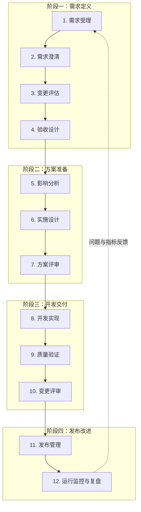

# AI 自动化研发工作流框架

## 文档定位

本文是团队的工作流总览，用于快速理解一项需求从进入研发到上线复盘的完整路径。

- 本文只定义阶段、节点、分流规则和交接关系。
- 每个节点的具体操作、输入输出和质量门槛，见对应节点文档。
- AI 负责资料整理、代码扫描、实施、验证和记录；业务决策、风险判断和生产发布仍由对应 Owner 负责。

## 使用方式

1. 先查看全局流程，了解完整路径和四个阶段。
2. 从需求受理开始，在变更评估节点选择本次执行路径。
3. 按节点地图打开对应的详细文档执行，并将交接物写入任务产物目录。
4. 节点启动前按当前路径校验其“路径级准入产物”；缺失时不得继续执行。

## 适用范围

- 产品需求、缺陷修复、接口调整、设计还原和模块重构。
- 同一条消息上传的需求文档截图和设计稿截图，Git 仓库、CI 和线上监控数据。
- Web、桌面壳、公共包等项目；不同项目可按风险等级裁剪流程。

## 任务产物规范

每个需求或缺陷都必须有独立任务目录，节点之间只通过文件交接，不依赖聊天记录或个人记忆。

默认目录：`/Users/j/codes/ai-workflow/tasks/<task-id>/`

`task-id` 默认使用 `<YYYYMMDD-HHMMSS>-<模块名>`。目录根部必须有 `task.yaml`，记录目标模块、当前节点、任务状态、产物清单、下一节点对应 Skill 和阻塞项。每个节点完成后必须写入对应文件，并在文件头声明 `artifact`、`task_id`、`node`、`status`、`target_module`、`inputs`、`depends_on`。

| 节点 | 固定产物文件 |
| --- | --- |
| 1. 需求受理 | `01-requirement-analysis.md` |
| 2. 需求澄清 | `02-requirement-clarification.md` |
| 3. 变更评估 | `03-change-assessment.json` |
| 4. 验收设计 | `04-acceptance-checklist.md` |
| 5. 影响分析 | `05-impact-analysis.md` |
| 6. 实施设计 | `06-implementation-plan.md` |
| 7. 方案评审 | `07-solution-review.md` |
| 8. 开发实现 | `08-development-record.md` |
| 9. 质量验证 | `09-quality-verification.md` |
| 10. 变更评审 | `10-change-review.md` |
| 11. 发布管理 | `11-release-record.md` |
| 12. 运行监控与复盘 | `12-monitoring-retrospective.md` |

节点启动时必须先读取其路径级准入产物文件；文件缺失、状态不是 `completed` 或 `approved` 时，任务为 `BLOCKED`。聊天中只输出摘要和产物路径，不作为正式交接物。

## 全局流程

## 变更分流

所有变更先完成最小的需求受理，再由变更评估节点选择执行路径。全局流程图展示的是标准路径；低风险改动可跳过独立节点，但必须保留必要的交接记录。

变更评估由工作流执行器自动运行：读取需求解析包和目标模块扫描结果，生成 `change-assessment.json`，再按结果解锁对应节点。自动分流按以下顺序执行：

1. **资料完整性检查**：缺少目标模块、预期行为、需求类型或关键接口/设计信息时，标记为 `NEEDS_CLARIFICATION`，退回需求澄清，不选择路径。
2. **复杂触发器检查**：涉及权限、安全、金额、隐私、不可逆删除、数据迁移、破坏性接口契约、公共能力、全局配置或多业务模块时，判定为复杂需求。
3. **快速修复检查**：仅修复已定义行为，影响范围局限于一个业务模块，且不涉及接口契约、数据、权限、公共能力或跨模块状态时，判定为快速修复。
4. **轻量需求兜底**：资料明确、范围局限于一个业务模块、未命中复杂触发器的常规功能或体验调整，判定为轻量需求。

没有有效评估结果时，不允许进入开发实现。复杂需求会自动进入完整路径；只有资料不足、低置信度或人工覆盖自动结论时，才需要 Owner 确认。具体规则见 [变更评估](./ai-workflow/nodes/03-change-assessment.md)。

| 路径 | 适用场景 | 最小执行范围 |
| --- | --- | --- |
| 快速修复 | 修复已定义行为的局部缺陷，范围明确且可快速回滚。 | 需求受理 -> 变更评估 -> 开发实现 -> 质量验证 |
| 轻量需求 | 单业务模块内、资料明确的常规功能或体验调整。 | 需求受理 -> 需求澄清 -> 变更评估 -> 实施设计 -> 开发实现 -> 质量验证 -> 变更评审 |
| 复杂需求 | 命中复杂触发器，或存在多模块、契约、数据和交付风险。 | 需求受理 -> 需求澄清 -> 变更评估 -> 验收设计 -> 影响分析 -> 实施设计 -> 方案评审 -> 开发实现 -> 质量验证 -> 变更评审 -> 发布管理 -> 运行监控与复盘 |

发布管理和运行监控与复盘按版本或发布批次统一执行，不要求每条快速修复或轻量需求单独重复执行；如果某项需求独立发布，则按实际发布范围补齐对应节点。

## 节点地图

每个节点都要沉淀最小交接物并写入任务目录。节点详情统一定义“适用路径、路径级准入产物、本节点产物和缺失处理”；工作流执行器只在当前路径所需产物文件齐全时解锁节点。低风险改动可以使用简短结构化记录，但仍必须落入对应固定文件。

| 阶段 / 节点 | 关键目标 | 最小交接物 | 详细说明 |
| --- | --- | --- | --- |
| 需求定义 / 1. 需求受理 | 建立任务上下文。 | 需求解析包、缺失资料清单 | [需求受理](./ai-workflow/nodes/01-requirement-intake.md) |
| 需求定义 / 2. 需求澄清 | 明确范围、规则、边界和待确认项。 | 需求解析包、待确认问题 | [需求澄清](./ai-workflow/nodes/02-requirement-clarification.md) |
| 需求定义 / 3. 变更评估 | 自动判断风险等级和执行路径。 | `change-assessment.json` | [变更评估](./ai-workflow/nodes/03-change-assessment.md) |
| 需求定义 / 4. 验收设计 | 定义可执行的验收标准。 | 验收清单、测试数据与联调依赖 | [验收设计](./ai-workflow/nodes/04-acceptance-design.md) |
| 方案准备 / 5. 影响分析 | 识别代码、接口、权限和回归范围。 | 影响范围报告、关键文件与回归范围 | [影响分析](./ai-workflow/nodes/05-impact-analysis.md) |
| 方案准备 / 6. 实施设计 | 设计改动、验证和回滚方案。 | 实施计划、验证与回滚方案 | [实施设计](./ai-workflow/nodes/06-implementation-design.md) |
| 方案准备 / 7. 方案评审 | 确认方案可以进入开发。 | 评审结论、批准记录、待办项 | [方案评审](./ai-workflow/nodes/07-solution-review.md) |
| 开发交付 / 8. 开发实现 | 完成代码、测试和自测。 | 代码变更、自测结果、已知风险 | [开发实现](./ai-workflow/nodes/08-development-implementation.md) |
| 开发交付 / 9. 质量验证 | 验证功能、视觉和回归风险。 | 验证报告、缺陷与阻塞项 | [质量验证](./ai-workflow/nodes/09-quality-verification.md) |
| 开发交付 / 10. 变更评审 | 审查最终差异和发布条件。 | Review 结论、发布建议、风险接受记录 | [变更评审](./ai-workflow/nodes/10-change-review.md) |
| 发布改进 / 11. 发布管理 | 控制构建、灰度、发布和回滚。 | 发布记录、灰度结果、回滚记录 | [发布管理](./ai-workflow/nodes/11-release-management.md) |
| 发布改进 / 12. 运行监控与复盘 | 观察线上质量并沉淀改进项。 | 监控结论、复盘项、治理任务 | [运行监控与复盘](./ai-workflow/nodes/12-production-monitoring-retrospective.md) |

## 人工关口

以下场景不能由 AI 自主通过：

- 不同截图之间存在业务规则冲突，或截图无法覆盖关键规则。
- 涉及权限、金额、隐私、删除、数据迁移和外部跳转。
- 修改公共组件库、全局样式、基础请求层或路由入口。
- 接口契约变化、后端未确认字段或状态码。
- 生产发布、回滚和灰度扩大。

建议将人工确认集中在“业务与方案确认”“变更评审”“发布管理”三个位置；轻量需求可将方案评审合并到实施设计中，但仍需保留确认记录。

## 使用原则

- 节点之间通过任务目录中的结构化交接文件衔接，不依赖聊天上下文。
- 每个节点都要有明确的输入、输出、失败处理和完成条件。
- AI 默认只在独立分支或 worktree 中写代码，不直接合并、发布或执行破坏性操作。
- 线上问题和复盘结论必须回流到后续需求、验收和规范中。

## 推荐入口

- 仓库内可调用 Skills 目录：`/Users/j/codes/ai-workflow/skills`
- 需求受理：`$01-requirement-intake`
- 需求澄清：`$02-requirement-clarification`
- 变更评估：`$03-change-assessment`
- 验收设计：`$04-acceptance-design`
- 影响分析：`$05-impact-analysis`
- 实施设计：`$06-implementation-design`
- 方案评审：`$07-solution-review`
- 开发实现：`$08-development-implementation`
- 质量验证：`$09-quality-verification`
- 变更评审：`$10-change-review`
- 发布管理：`$11-release-management`
- 运行监控与复盘：`$12-production-monitoring-retrospective`
- 复杂模块审查和重构：`$legacy-module-governance`（跨节点通用能力）
