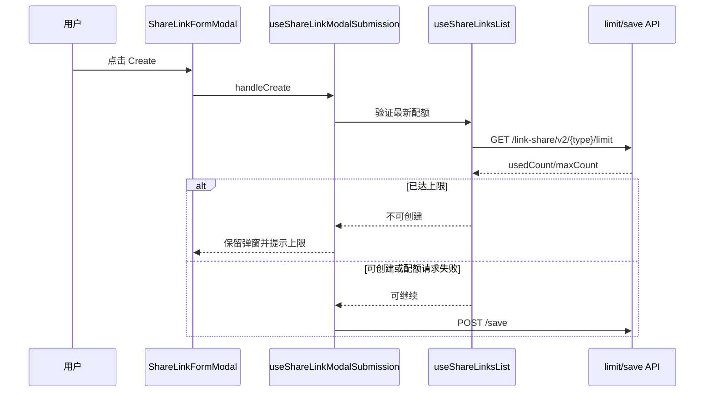

# Links Share Links 实施计划

## 方案结论

本次只补齐已确认需求与当前实现之间的 3 个差异：

1. 编辑保存后也应在 15 秒后补刷列表和配额，使 Processing 能自动更新为 Active。
2. 创建提交前重新读取当前类型配额，避免多人并发或页面停留后继续发出超限创建请求。
3. Share links 的 Last updated、Date created 复用 Links 现有的报告时区格式化能力。

不重构 Share links 目录，不改旧分享流程，不恢复已移除的指标或 Link 选项缓存。

## 文件级改动

| 文件 | 动作 | 实施内容 |
| --- | --- | --- |
| `components/share-links-tab/hooks/useShareLinksList.ts` | 修改 | 将配额请求收口为可返回最新归一化配额的刷新方法；保留列表初始化、删除后的刷新与页面展示状态同步；新增“创建是否仍可用”的判断能力。接口失败时不阻塞创建，继续由后端兜底。 |
| `components/share-links-tab/hooks/useShareLinksListController.tsx` | 修改 | 向弹窗层透出提交前配额校验方法，不在行操作 controller 内重复调用 limit 接口。 |
| `components/share-links-tab/entry/TrackingShareLinksTab.tsx` | 修改 | 将提交前配额校验能力从列表 controller 传入弹窗 controller；不改变 Tab 挂载和当前的 list/empty-state 判定。 |
| `components/share-links-tab/hooks/useShareLinkModalController.tsx` | 修改 | 接收并传递配额校验能力给提交 hook；保留 Creator/Link 选择、回填与数量限制逻辑。 |
| `components/share-links-tab/hooks/useShareLinkModalSubmission.ts` | 修改 | 创建前先执行最新配额校验；上限已满时保留弹窗并提示，不调用 save。创建或编辑成功后都安排一次 15 秒补刷；立即刷新行为保持不变。 |
| `components/share-links-tab/hooks/useShareLinkPostCreateRefresh.ts` | 修改 | 保持现有单次 timer 与卸载清理机制，调整职责和命名说明为“创建/编辑后的状态补刷”；重复提交时先取消旧 timer。 |
| `components/share-links-tab/components/share-links-list/useShareLinksListColumns.tsx` | 修改 | 使用 `useLinkListDateFormatter` 渲染 Last updated 与 Date created，替换直接调用 `formatLinkDisplayDateTime`；日期为空继续显示 `-`。 |
| `FLOW.md` | 修改 | 更新 Share links 章节的 controller 路径、列表/弹窗分层和无缓存现状；同步创建与编辑均会补刷的流程说明。 |

## 数据与状态流

### 1. 创建配额校验



- 配额校验只用于创建，编辑不受 Agency 新增配额限制。
- Tracking 与 Free trial 继续按各自 URL 查询配额，不能共享结果。
- `limit` 请求异常或非成功响应时不在前端误拦截，保持现有“服务端最终兜底”的策略。
- 保存接口仍需处理后端返回的超限错误，不做乐观新增。

### 2. 创建与编辑后的状态刷新


- 后端状态仍只以 `dataReady` 判断：`false` 为 Processing，`true` 为 Active。
- Processing 行继续禁用 Edit，但保留 Preview、Copy、Delete。
- 只保留一个补刷 timer；再次创建/编辑会先清除上一次 timer；组件卸载时清理。

### 3. Share links 日期展示

- 不修改通用 `formatLinkDisplayDateTime`，避免影响 Dashboard 和详情页的既有显示。
- Share links 表格列复用 `useLinkListDateFormatter`，从当前用户的 `reportTimezoneId` 获取 offset。
- 仅对 `createdAt` 与 `dataLastUpdateTime` 格式化为 `YYYY/MM/DD`；接口空值或非法值显示 `-`。

## 接口与字段约束

| 场景 | 接口/字段 | 前端处理 |
| --- | --- | --- |
| 列表 | `POST /link-share/v2/{tracking-link|trial-link}/page` | 保持显式传 `page`、`size=50`、`requireTotal=true`、`shareName`；不依赖 API 层的 `size=1000` 默认值。 |
| 配额 | `GET /link-share/v2/{tracking-link|trial-link}/limit` | 使用 `shareLinkNumLimit`、`linkNum`、`shareLinkCreatorLimit`、`shareLinkCreatorLinksLimit` 归一化结果。 |
| 创建 | `POST /link-share/v2/{type}/save` | 提交前校验最新配额；仍由后端处理最终并发限制。 |
| 编辑 | `POST /link-share/v2/{type}/update` | 保存成功后与创建一致立即刷新并延迟补刷。 |
| 状态 | `dataReady` | 统一映射为 Processing / Active，不新增前端状态枚举。 |
| Creator | `modelBindStatus` | 继续只用于列表状态点和保存失败后的掉线状态更新。 |
| Link | `showDeactivatedLinks=false`、`linkInfo.enable` | 新选项继续排除停用 Link；已关联历史 Link 不主动阻断编辑提交。 |

## 不在本次计划内

- 不修改分享落地页、验证码校验、Creator 删除后的数据移除、Link 停用后的服务端数据保留。
- 不修改 `legacy-share-link/*`，旧接口和旧弹窗仅在 `newShareLinkV1` 关闭时工作。
- 不修改 `newShareLinkV1` 和 `ShareLink` 权限判断逻辑。
- 不恢复 share links metrics 或 tracking link options 的本地缓存。
- 不修改 Links list / Dashboard 的共享筛选状态。
- 不调整表格、弹窗或公共组件的视觉样式。

## 验证策略

### 代码检查

```bash
yarn tsc
```

若项目当前环境不适合全量类型检查，至少检查改动文件的 TypeScript 报错，并执行：

```bash
git diff --check
```

### 手工验证

1. 在 Tracking 和 Free trial 两个页面分别验证创建、编辑后的即时刷新与 15 秒补刷。
2. 配额未满时创建正常；达到上限时列表态和空态 Create 按钮禁用；弹窗已打开后若配额被其他用户耗尽，提交不会发送 save。
3. 配额接口异常时前端不误拦截创建，后端错误仍按现有错误映射展示。
4. 使用不同时区账号确认 Share links 两个日期列与页面 Header 的报告时区一致；空日期显示 `-`。
5. 回归 `newShareLinkV1` 开关开启/关闭、ShareLink 权限有无、旧行内分享入口、Processing/Active 操作权限。
6. 回归 Creator 搜索去重、Link 搜索/滚动加载/上限删除、编辑 label 回填、重名和 Creator 掉线错误。

## 灰度与回滚

- 上线前保持 `newShareLinkV1` 灰度可关闭。
- 若新版 Share links 出现阻断问题，关闭灰度后回到 `legacy-share-link` 行内分享流程。
- 本次改动集中在新版 Share links 目录和 `FLOW.md`，可按独立提交回滚；不与旧分享流程或主列表筛选改动混提。
- 发生配额或异步状态异常时，优先回滚本次提交策略，不修改后端状态机或接口字段映射。

## 方案评审关注点

| 关注点 | 推荐结论 |
| --- | --- |
| 编辑是否需要补刷 | 需要。已确认状态流要求 Processing 自动变为 Active，创建和编辑应一致。 |
| 配额请求失败是否阻断创建 | 不阻断。沿用当前策略，避免前端因临时接口失败误禁用业务，后端负责最终拒绝。 |
| 日期时区如何接入 | 只在 Share links 表格列复用既有 `useLinkListDateFormatter`，不改全局日期工具。 |
| 是否影响旧分享入口 | 不影响。所有代码改动仅限新版 Share links 流程。 |

## 节点交接

- 当前节点：实施设计。
- 状态：`completed`。
- 下一节点：方案评审。
- 下一节点准入：需求负责人确认本实施计划。
- 确认后：写入 `07-solution-review.md`，再进入开发实现。
